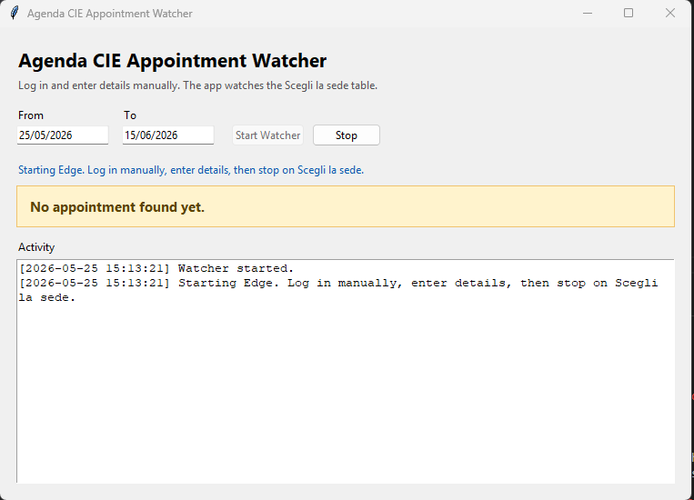

# Agenda CIE Appointment Watcher

Local Windows GUI watcher for the Italian `Agenda CIE` appointment flow, built with `Tkinter` and `Selenium`.

The watcher is intentionally limited to the protected `Scegli la sede` step of the official flow. You still complete login, CAPTCHA, and request details manually in Microsoft Edge. Once the table is visible, the app refreshes the page on a fixed interval, scans the currently rendered rows, and alerts when it finds a selectable appointment inside your chosen date range.



## What It Does

- Opens or attaches to a Microsoft Edge session with remote debugging enabled
- Reuses a local Edge profile stored in `edge-profile-selenium/`
- Watches the `Scegli la sede` page only
- Scans rows from:
  - `Comune di Roma`
  - `Comuni vicini a Roma`
- Filters results by a user-provided date range
- Shows an in-app status update and a Windows desktop alert when a match is found
- Writes activity logs to `appointment_notifier.log`

## Why This Tool Exists

Appointment availability on `Agenda CIE` can depend on the exact selections made earlier in the official flow, including request type and other manual inputs. Generic availability checks done outside that flow can drift from what the website actually offers for your real request.

This tool avoids that mismatch by reading the same appointment table you see after completing the official steps yourself.

## Boundaries

This app does not:

- automate login
- solve CAPTCHA
- submit personal data for you
- bypass the official flow
- scrape arbitrary parts of the site

It is a local watcher for a page you already reached manually.

## Requirements

- Windows
- Python `>=3.11`
- Microsoft Edge
- Tkinter, included with normal Windows Python installs
- Selenium `4.44.0`

Selenium Manager is used to resolve the matching Edge driver in normal setups.

## Install

From the repository root:

```powershell
python -m pip install -e .
```

If PowerShell script execution is restricted, you can still run the Python entry point directly:

```powershell
python .\selenium_takeover.py
```

## Start

Preferred launcher:

```powershell
.\run_selenium_takeover.ps1
```

Installed console script:

```powershell
cie-appointment-watcher
```

Direct Python entry point:

```powershell
python .\selenium_takeover.py
```

## Usage

1. Start the GUI.
2. Enter the acceptable date range using `DD/MM/YYYY` or `YYYY-MM-DD`.
3. Click `Start Watcher`.
4. In the Edge window, complete the official flow manually:
   1. log in
   2. solve CAPTCHA if required
   3. enter the real request details
   4. continue until the page says `Scegli la sede`
5. Leave the browser on that page.
6. Let the watcher refresh and scan until a selectable date appears.

When a matching row is found, the app:

- updates the GUI status
- highlights the latest match in the alert panel
- flashes the screen
- beeps
- opens a desktop alert window
- writes the event to `appointment_notifier.log`

## Runtime Behavior

- Refresh interval: `60` seconds by default
- Remote debugging port: `9333` by default
- Profile directory: `edge-profile-selenium/` by default
- Default date range in the GUI:
  - start: today
  - end: today + 21 days

If Edge is already running with the configured debugging port, the watcher attaches to that session. Otherwise it starts a new Edge instance with the required flags.

## Configuration

The watcher tries to find `msedge.exe` in this order:

1. `PATH`
2. `C:\Program Files (x86)\Microsoft\Edge\Application\msedge.exe`
3. `C:\Program Files\Microsoft\Edge\Application\msedge.exe`

If Edge is installed elsewhere, set `AGENDA_CIE_EDGE_PATH`.

Optional environment variables:

- `AGENDA_CIE_EDGE_PATH`: full path to `msedge.exe`
- `AGENDA_CIE_DEBUG_PORT`: remote debugging port, default `9333`
- `AGENDA_CIE_CHECK_INTERVAL_SECONDS`: refresh interval in seconds, default `60`
- `AGENDA_CIE_PROFILE_DIR`: Edge profile directory, default `edge-profile-selenium/`

Example:

```powershell
$env:AGENDA_CIE_EDGE_PATH="D:\Apps\Edge\msedge.exe"
$env:AGENDA_CIE_CHECK_INTERVAL_SECONDS="45"
.\run_selenium_takeover.ps1
```

## Files

- `selenium_takeover.py`: GUI, runtime configuration, Selenium session handling, page scanning, and alerting
- `run_selenium_takeover.ps1`: Windows launcher
- `pyproject.toml`: package metadata and dependency pin
- `appointment_notifier.log`: runtime activity log
- `edge-profile-selenium/`: local Edge user data for the debug session
- `.gitignore`: ignored browser profile, logs, caches, and virtual environments

## Troubleshooting

### Edge was not found automatically

Cause:
Edge is not on `PATH` and is not installed in one of the standard locations.

Fix:
Set `AGENDA_CIE_EDGE_PATH` to the full executable path before starting the app.

### Edge did not open the remote debugging port

Cause:
The browser did not start correctly, another process is already using the port, or local policy blocked startup.

Fix:

- close old debug Edge sessions
- try a different `AGENDA_CIE_DEBUG_PORT`
- confirm Edge can start normally on the machine

### The GUI says it is waiting for `Scegli la sede`

Cause:
The watcher only scans the target page and ignores earlier steps.

Fix:
Complete the official flow manually and stop on the `Scegli la sede` page.

### No appointments are found even though the page loads

Cause:
There may be no selectable rows in the current date range, or the available rows may be locked.

Fix:

- widen the date range
- confirm the visible rows contain selectable radio buttons
- check both the Rome and nearby municipalities tabs

### Refresh failed or browser session failed

Cause:
The Edge session was closed, detached, or Selenium lost the connection.

Fix:

- restart the watcher
- reopen the target page manually
- if needed, delete `edge-profile-selenium/` and start fresh

## Logging

The watcher appends timestamped messages to `appointment_notifier.log` in the repo root. That log is useful for confirming:

- startup errors
- page wait states
- refresh failures
- match notifications

## Privacy

The app does not ask for or store:

- SPID credentials
- CIE credentials
- passwords
- codice fiscale
- copied cookies

The local Edge debug profile is stored on disk only so the browser session can be reused.

## Architecture

High-level implementation notes are in [ARCHITECTURE.md](./ARCHITECTURE.md).

## Stop

Click `Stop` in the GUI or close the GUI window.
